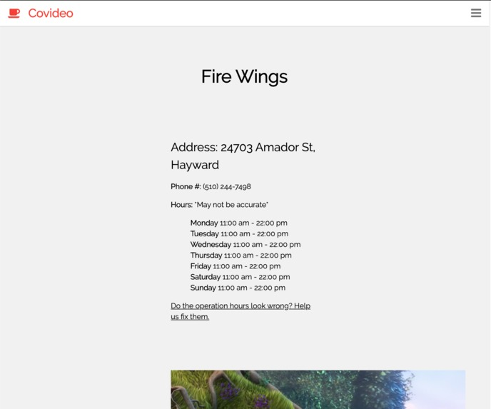

# Covideo - A Space for Your Favorite Place

## [A CalHacks hack:now project](https://hacknow.calhacks.io/)

In April of 2020, amidst a brooding pandemic, I decided to join a hackathon. I was coming off of a few weeks of binging Golang fundamentals and beginning to dabble in some front-end. I teamed up with my brother and one of his friends, along with a good friend from college and awaited the second-to-last week of April.

This was my first hackathon. I'd only heard about what usually goes on - coffee, grit, mentors, all-nighters, energy drinks - what did I sign up for? I was also pleasantly surprised to find workshops being offered. I love getting tons of information distilled into a crash course. (I think that's pretty common though, right?)

I was the de facto project manager, since I actually have industry experience (everyone else was either halfway through college for CS or just starting). I enjoyed planning, delegating, unblocking, and talking next steps. This is definitely something I will look to get into in the future.

Also, I'm proud of this code, but for a different reason than I am with most other code I write. If you look at either of the snake pits, they're not organized too well and are questionably reusable, but they got the job done. They also represent a really awesome experience of me mentoring someone through the concepts of ETL and the Python programming language. (You'll see the progress we made as the hours passed, as well as introduction of some concepts like closures and factory methods.)

This project also represents the first time I've understood all the parts of a full-stack developer. I have so much more respect for those engineers!

## Init

Covideo came off a brain-storming of what kind of needs our community is currently facing. When considering programs, I focused on what kinds of problems were already being tackled and what areas of my community I wanted to support. I also wanted to make something I could easily break up to delegate, since my friends weren't very familiar with web apps. Initially, we thought of two projects:

- some sort of solely back-end API used to deliver culturally relevant content or encouragement that could be embedded into websites, and
- a website to showcase the personalities of local businesses (particularly restaurants) through various mediums.

We ended up choosing the latter, and Covideo was born. (The name is a work in progress. ahaha)

# The Product

This is what our landing page looks like.

The vision of Covideo is is twofold - firstly, to give small, local businesses a place to show a bit of their personality whether it be through a quick bit of text, some photos, a video, even an audio message. This provides customers with a bit more of an intimate connection rather than purely an online storefront. Secondly, Covideo gives business owners or customers a place to update hours and transaction methods (e.g. delivery, pickup, takeout) in real time.

This is a product that would require an extreme amount of bootstrapping to get started, so for initial data, we decided to use the Yelp data to map out a bunch of restaurants within the San Francisco East Bay Area and get a restaurant directory up and running.

Let's get to the technologies we used.

## The Stack

We ended up developing on the following stack:
- Front-End
    - Flask server
        - serves static HTML and CSS
        - forwards some requests to back-end
    - W3 templates
- Back-End
    - Flask server
        - provides an API for accessing Google Firestore
- Data Storage
    - Google Firestore
        - quick no-SQL DB for prototyping and storing big objects
    - Google Storage
        - storing big
- Server Hosting
    - repl.it
        - each repl has the capability to open up a server over the internet
- Collaboration Tools
    - repl.it
        - repl.it provides live coding in the same repls.

repl.it was SUPER helpful.

## The Process

After writing a design doc and isolating our goals and tasks, I decided to take on the back-end and ETL with my friend from college. He just started learning Python a few months ago and is transitioning from the cool industry of Biotech. I tried to write as little code as possible and focus more on explaining programming and web dev concepts. Overall, it was a really cool experience of mentoring a budding developer.

My brother and his friend from high school took on the front end. They were responsible for creating a Flask server that served a nice HTML template. Neither of them had done this before either, so our team did a lot of on-the-spot learning. Every so often, I would be able to unblock my brother with Flask issues, but for the most part, him and his friend held their own.

### Back-end and ETL
To start, I wanted to have adequate data to pull from. This meant I needed to write some ad-hoc ETL to  I first checked to see how robust [Yelp's API](https://www.yelp.com/developers/documentation/v3) was. I wanted to find businesses around my area and their hours. They had a pretty interestingly designed API! The way I might navigate it conceptually was very similar to how I would navigate their mobile app. Who would've thought!

After registering an application to use the API, I walked my friend through how to batch process information from the API. We used [Yelp's Postman API](https://www.getpostman.com/run-collection/6b506a43109229cb2798) collections to get a feel for how the data was structured and how we might call it. I ended up using [ZipCodeAPI](https://www.zipcodeapi.com/API#radius) to grab a bunch of zip codes around the east bay, which we used to feed into our Yelp API calls. By the end of the first night, we created a JSON containing 578 different local businesses.

The next afternoon, with all our businesses in JSON, we started mapping out endpoints we could serve to front-end requests. There was a `/businesses` endpoint that returned all business IDs (which could be scaled for sorting, filtering, and paging) and `/business/<id>` for returning information about a particular database.

Soon, it was time to load all our data into a data store. We used Google Firestore, a speedy document store. My friend and I began by writing code to connect to the database, and then decided on a schema to format our businesses to. In the preliminary designs, I thought it'd be good enough to send JSON straight from the document store to the front-end.

One of the primary ways of finding a business on our site would be through search, so I started working on a `/businesses/search` endpoint right after verifying our other endpoints were sending dummy data. I learned the importance of unblocking other teams, because we needed to work in parallel.

Bit by bit, my friend and I built up the business search feature, first by implementing a basic exact, case-insensitive match, then a fuzzy match. There was a super confusing issue where one of the lower-level C-dependency packages of `python-Levenshtein` (an edit-distance calculator) conflicted with a package `firebase-admin` depended on. I won't get into that, but it was a major headache to debug. Once the fuzzy search was done, we quickly threw in a search-by-zip-code. With that, the back-end was complete. We had the feature-set we were happy with. (Also, it was 3am.)

### Front-End

I didn't do a whole lot of work on the front-end, but I do have screenshots of it. It was written on another repl.it by my brother and his friend from high school. They're both learning CS in school, and are about second-years. Neither of them have touched web dev before this week, and they did an awesome job figuring out how to connect templates to application logic. Every so often, I'd check in, help make design decisions, and try to unblock. Here's what it ended up looking like:

This is how the search results were shown.

We had a page where businesses could register. People could also fill this out to recommend we connect with a local business.

Here's an example of a page a business would be able to customize.

## The Lernes

There we go. This was designing a simple web app from front to back. I think I understand frameworks like Gatsby or Django a lot more now, seeing what trade-offs they make where.

Technically, my next step will be to dive into React.js and Gatsby alongside CSS Grid and Flexbox. It was such an enlightening experience to walk through the whole stack from data ingestion to display. It'll probably be something I look for in my next job.

In terms of mentoring, I really enjoyed the project management side of coding. It was satisfying seeing the product improve incrementally by the work of tasks being delegated.

This was such a good first-hackathon experience. I will definitely be doing more!

As Chaucer famously said, 
> The lyf so short, the craft so longe to lerne.
